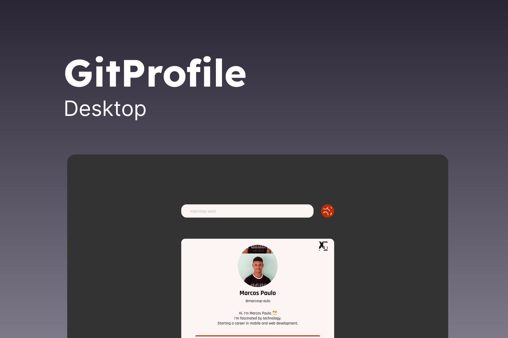

<h1 align="center">
    
</h1>

  

 

 

  

## ✨ Technologies

This project was developed with the following technologies:

- [ReactJS](https://reactjs.org)
- [Typescript](https://www.typescriptlang.org/)

## 💻 Project

GitProfile is an application to fetch data from any user on Github, including their repositories, followers, etc.

## 🔖 Layout

The layout can be viewed through this [link](https://www.figma.com/file/HxRs0U6ZPaYHWdi3E3Upbc/GitProfile?node-id=49%3A2). But for that it is necessary to have an account in [Figma](https://figma.com).

## 🚀 Run the project

- Clone this repository.
- Install dependencies with `yarn`
- Start the server with `yarn dev`

Now access [`localhost:3000`](http://localhost:3000) in your browser to view the application.

## 📄 License

This project is under the MIT license.

---

Made by [Marcos Paulo](https://github.com/marcosp-aulo) ❤

